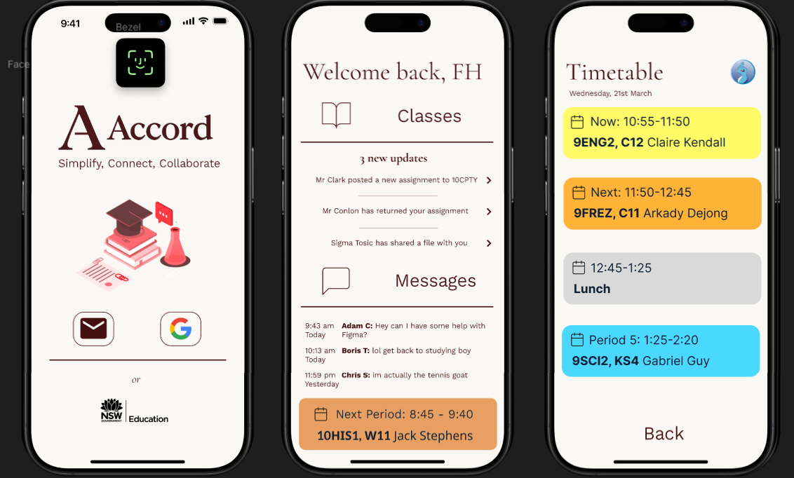

# Accord – A Social Networking App for Students

## Table of Contents!

- [Part 1 – Project Definition and Requirements](#part-1--project-definition-and-requirements)
  - [Project Overview](#project-overview)
  - [Functional Requirements](#functional-requirements)
  - [Non-Functional Requirements](#non-functional-requirements)
  - [Project Status](#project-status)
  - [Developer Notes](#developer-notes)
- [Part 2 – Design and Wireframes](#part-2--design-and-wireframes)
- [Part 3 – Implementation and Codebase](#part-3--implementation-and-codebase)
- [Part 4 – Testing and Evaluation](#part-4--testing-and-evaluation)
- [Part 5 – Future Improvements](#part-5--future-improvements)

---

## Part 1 – Project Definition and Requirements

### Project Overview

Accord is a cross-platform social networking and productivity app designed specifically for students, schools, and educational institutions. It is inspired by the best of both Google Classroom and Discord, merging instant messaging, assignment submission, and time management into one single, mega-intuitive interface.

Accord helps students communicate, collaborate, and stay organized—all within a secure and moderated environment tailored to meet the needs of education in 2025. Through its real-time messaging system, students can easily engage in class discussions, form study groups and calls, and share ideas freely, while teachers are still in control over message visibility and moderation.

---

### Functional Requirements
- **User Authentication**
  - Secure login and signup  
  - Role-based access (Student [with sub roles] / Teacher )
- **Messaging**
  - Real-time chat channels per class or subject  
  - Teacher moderation and message controls
- **Assignments**
  - Student file submissions  
  - Teacher viewing, feedback, and marking
- **Timetable**
  - Dynamic school-provided schedule  
  - Offline access to cached timetable
- **Profile & Settings**
  - Avatar upload, theme choice, notification preferences
- **Notifications**
  - Alerts for new messages, deadlines, and timetable changes

---

### Non-Functional Requirements
- **Interface** – Clean, minimal layout; consistent colour scheme (navy blue, grey, white accents); responsive on mobile, tablet, desktop.  
- **Performance** – Fast loading, smooth screen changes, low-latency messaging.  
- **Security** – Encrypted login/data, sensible permissions.  
- **Accessibility** – Adjustable text size, high-contrast mode.  
- **Reliability** – Stable performance, offline access to timetable and past assignments.  
- **Scalability** – Handles multiple schools and hundreds of users.

---

### Scope (what I really want to work)
✅ Login & roles  
✅ Class-based real-time messaging  
✅ Assignment submission + marking  
✅ View-only timetable with updates  
✅ Profile basics (avatar, theme, notifications)  

### Out of Scope (what would be sick but aint no way)
❌ Voice/video calls  
❌ AI assistant??
❌ Parent/guardian portals for things like permission notes etc

### Developer Notes

Hi
---

## Part 2 – Design and Wireframes

**Key Annotations:**
- **Navigation** – Bottom bar with Chat, Timetable, Assignments, for super-friendly mobile use  
- **Timetable** – Timetable list → nice colours and organised
- **Login Page** – Simple options → clean buttons

---

### Visual Design Choices
| Element        | Choice                                | Reason |
|----------------|---------------------------------------|--------|
| Primary Colour | Navy (#0A1F44)                        | Professional, doesn't hurt to look at |
| Secondary      | White (#FFFFFF)                 | Looks great against navy |
| Accent         | Green (#1DB954)                        | helps to draw attention to active items |
| Font           | Inter (Headings & Body)                | Clean, modern |
| Icons          | Nice line icons             | Simplicity and consistency |

---

## Part 3 – Alternative Design and User Flow

### Alternate Design (Figma :o )

**Changes in Alt Design:**
- Beige background for softer look  
- Maroon accent colour instead of blue  
- Serif headings (Cormorant Garamond) for a different style, feels fancier and more academic  
- Intergrated navigation bar instead of bottom bar  

---

### Updated Design
| Element     | Choice              |
|-------------|---------------------|
| Logo        | Fancier “A” mark with text   |
| Secondary   | Just fancier A           |
| Palette     | Maroon, Beige, White, Black |
| Typography  | Verdana (UI), Cormorant Garamond (Headings) |

---

## Part 4 – Testing and Evaluation

---

## Part 5 – Future Improvements
